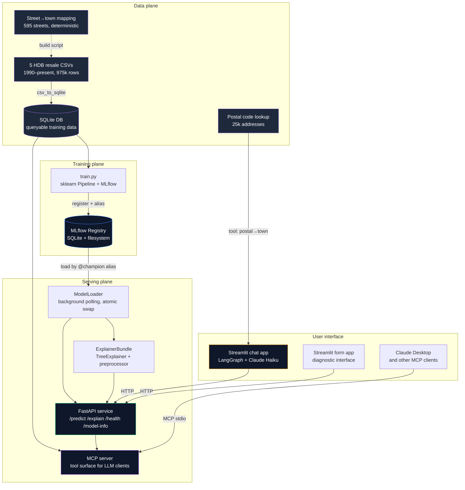

# HDB Resale Price Predictor — MLOps Platform


A production-style MLOps platform for predicting Singapore HDB resale prices, with a chat-driven user interface on top. The model trains on 30+ years of public resale transaction data, serves predictions and SHAP-based explanations through a FastAPI service, and is wrapped by a Claude Haiku agent that turns plain-English property descriptions into structured predictions with natural-language explanations of what's driving the price.

> **Status (June 2026)** — Phases 1, 1.5, 1.6a, 1.6b, and 1.6c are complete. Phase 1.6b added the MCP server: prediction, explanation, postal lookup, model-info, and comparable-search are callable as Model Context Protocol tools from Claude Desktop or any other MCP client. Phase 1.6c replaced the chat agent's Anthropic tool-use loop with a LangGraph orchestration graph that calls those MCP tools as a deterministic state machine. See [What's next](#whats-next).

## What this demonstrates

The interesting parts of this repo, with specifics:

- **MLflow alias-based promotion** (not stages — they're deprecated). `@champion` and `@challenger` aliases drive lifecycle management. Atomic model + SHAP explainer swap under a single `threading.Lock` so the explainer can never be out of sync with the loaded model. Background thread polls the registry every 60s; reload is a pointer swap, not a service restart.
- **SHAP TreeExplainer wired into a `/explain` endpoint** with mathematical correctness asserted by test — `sum(feature_contributions) + base_value ≈ predicted_price` within 1 SGD.
- **A deliberate 5.8% RMSE trade-off** to halve the form complexity. The model predicts on 5 fields the user can actually answer (town, flat type, floor area, lease year, transaction month) instead of 7 that include `flat_model` and `storey_range` — values most users don't know off the top of their heads. RMSE went from SGD 27,690 to SGD 29,296. Documented and intentional.
- **Preprocessing baked into the sklearn `Pipeline`.** No training-serving feature pipeline duplication. The model artefact is end-to-end: raw input goes in, prediction comes out. A custom `MonthToFloatTransformer` converts `YYYY-MM` to fractional years inside the `ColumnTransformer`.
- **Postal-code first chat UX.** Users type `"3 room flat in Tampines, 95 sqm, lease started 1985, postal 522201"` in plain English. The agent calls `lookup_postal_code` to resolve postal → town, then `predict_hdb_price` for the price, then `explain_hdb_price` and narrates the top 3 SHAP contributors back to the user in English.
- **MCP server exposing the platform to any LLM client.** Five tools — `predict_price`, `explain_prediction`, `lookup_postal_code`, `get_model_info`, `find_similar_transactions` — are served over the Model Context Protocol, so Claude Desktop or Cursor call the same prediction and explanation logic the Streamlit chat uses, with no per-client code. The server calls the platform's Python modules directly rather than HTTP-wrapping FastAPI: one process, shared in-memory model, no localhost dependency ([ADR 0003](docs/adr/0003-mcp-direct-imports-not-http.md)). `explain_prediction` returns SHAP contributions twice over — raw feature names for programmatic consumers and human-readable labels for the LLM client to present directly — so a narrated explanation never leaks `cat__town_TAMPINES`-style pipeline internals.
- **LangGraph orchestration with a deliberate node per step.** The chat turn is an explicit state machine — `parse -> postal_lookup -> validate -> (predict -> explain) -> narrate` — not an LLM-driven tool-use loop. A conditional edge after `validate` routes missing-field, out-of-scope, and error states straight to `narrate`, skipping prediction. The orchestration layer (LangGraph) and the tool layer (the MCP server, called in-process) are separate concerns: the graph decides *what happens when*, the MCP tools *do the work*. The LLM is demoted to two bounded nodes — `parse` does JSON slot-filling, `narrate` phrases the result — both calling the Anthropic SDK directly, with per-node error handling so a tool fault is narrated gracefully rather than raised ([ADR 0004](docs/adr/0004-langgraph-orchestration-over-direct-tool-loop.md)).
- **239 tests** across schemas, model loader, FastAPI endpoints, MCP tools, training pipeline, postal lookup, predictor, the chat agent, and the orchestration graph — nodes, branch routing, and an end-to-end traversal against the real MCP tools. Pre-commit hooks enforce ruff, ruff-format, mypy, and a typed exception hierarchy in the API client.
- **Architecture Decision Records** under `docs/adr/` for choices that matter — alias-vs-stages, SQLite as a derived store, MCP direct imports over HTTP, and LangGraph orchestration over a direct tool loop.

## Architecture



The training plane produces immutable, registered model versions. The serving plane serves predictions over HTTP (FastAPI) and as agent-callable tools (MCP) — same model, same explainer, two interfaces for two consumer types. The UI plane has three entry points: a chat app (LangGraph orchestrating MCP tool calls via Claude Haiku), a diagnostic form app (direct HTTP), and any external MCP client (Claude Desktop, Cursor, future agent frameworks). The data plane is read-only at runtime.

## Try it

You'll need three terminals. Prerequisites:

- Python 3.12+ with `uv` installed (`brew install uv` on macOS)
- An Anthropic API key for the chat app: `export ANTHROPIC_API_KEY="sk-ant-..."`
- HDB resale CSVs in `data/raw/` (download from data.gov.sg if you're starting fresh)

### Setup (one-time)

```bash
git clone git@github.com:LEMSingapore/hdb-mlops-platform.git
cd hdb-mlops-platform
uv venv
source .venv/bin/activate
uv pip install -e ".[dev]"
python scripts/csv_to_sqlite.py   # builds data/hdb.db from the raw CSVs (~20s, 975k rows)
python -m training.train          # ~5 minutes, registers a model as @champion
```

### Terminal 1 — FastAPI service

```bash
source .venv/bin/activate
uvicorn serving.app:app --port 8000
```

Wait for "Loaded hdb-predictor version N" and "Application startup complete".

### Terminal 2 — Chat app (primary UI)

```bash
source .venv/bin/activate
streamlit run src/ui/chat_app/streamlit_app.py
```

Browser opens at `http://localhost:8501`. Try:

> 3 room flat in Tampines, 95 sqm, lease started 1985, postal 522201

### Terminal 2 alternative — Form app (diagnostic)

```bash
streamlit run src/ui/form_app/streamlit_app.py
```

Same endpoints, simpler UI — useful for debugging when the chat misbehaves.

### Claude Desktop via MCP

The MCP server runs without FastAPI — it loads the `@champion` model in-process. Configure Claude Desktop's `claude_desktop_config.json` to point at the project's virtualenv interpreter so the server runs with the project's dependencies:

```json
{
  "mcpServers": {
    "hdb-mlops": {
      "command": "/absolute/path/to/hdb-mlops-platform/.venv/bin/python",
      "args": ["-m", "mcp_server"],
      "cwd": "/absolute/path/to/hdb-mlops-platform"
    }
  }
}
```

Restart Claude Desktop, then ask:

> What's the resale price for a 4-room in Tampines, 95 sqm, lease started 1985? And show me 10 similar recent transactions.

Claude Desktop calls the MCP tools (`predict_price`, `explain_prediction`, `find_similar_transactions`) and synthesises an answer. Same model, same registry, same explainer that the Streamlit chat uses — exposed through a different protocol.

### Direct API access

```bash
curl -s -X POST http://localhost:8000/predict \
  -H "Content-Type: application/json" \
  -d '{"town": "TAMPINES", "flat_type": "4 ROOM", "floor_area_sqm": 95.0, "lease_commence_date": 1985, "month": "2024-06"}' \
  | python -m json.tool
```

### Try it via Docker (local)

Phase 2 Session A containerises the FastAPI service as a multi-stage image. Build it:

```bash
docker build -t hdb-mlops:dev .
```

Run the container, bind-mounting your local MLflow registry. MLflow records artifact locations as absolute paths in `mlflow.db`, so `mlruns/` is mounted at the *same absolute path* it occupies on the host — that is what lets the in-container model loader resolve the `@champion` artifacts:

```bash
docker run --rm -p 8000:8000 \
  -v "$(pwd)/mlflow.db:/app/mlflow.db" \
  -v "$(pwd)/mlruns:$(pwd)/mlruns" \
  hdb-mlops:dev
```

The container spawns the background polling thread and loads `@champion` on startup — wait for the "Loaded hdb-predictor version N" log line. Then, from another terminal:

```bash
curl -s -X POST http://localhost:8000/predict \
  -H "Content-Type: application/json" \
  -d '{"town": "TAMPINES", "flat_type": "4 ROOM", "floor_area_sqm": 95.0, "lease_commence_date": 1985, "month": "2024-06"}' \
  | python -m json.tool
```

Expect `predicted_resale_price` around `586900` with `model_version: 7`.

Mounting the host's SQLite file and `mlruns/` directly is deliberately a Session A stopgap. Because artifact locations are absolute host paths, this run command is host-specific — fragile by design. The "Try it via Docker Compose" section below replaces it with the portable two-service story. Session C adds GitHub Actions CI. See [docs/phase-2-design.md](docs/phase-2-design.md) and [docs/adr/0005-multi-stage-dockerfile-with-uv.md](docs/adr/0005-multi-stage-dockerfile-with-uv.md).

### Try it via Docker Compose

Compose brings up the platform the way a real deployment runs it: FastAPI as one service, MLflow as a separate tracking server on port 5000, talking over HTTP. FastAPI fetches model artifacts through the tracking server's artifact proxy and never reads the registry database or a host path directly — the fragility of the Session A bind-mount is gone. See [docs/adr/0006-mlflow-tracking-server-as-compose-service.md](docs/adr/0006-mlflow-tracking-server-as-compose-service.md).

One-time migration if your `mlflow.db` was built by local-process MLflow. MLflow records artifact locations as absolute host paths, which the containerised tracking server cannot serve. Rewrite them to portable `mlflow-artifacts:` proxy URIs once — the script is idempotent:

```bash
python scripts/migrate_artifact_paths_to_proxy.py
```

Then bring the stack up:

```bash
docker compose up -d --build
```

Wait for both services to report healthy, then predict against the FastAPI container:

```bash
docker compose ps

curl -s -X POST http://localhost:8000/predict \
  -H "Content-Type: application/json" \
  -d '{"town": "TAMPINES", "flat_type": "4 ROOM", "floor_area_sqm": 95.0, "lease_commence_date": 1985, "month": "2024-06"}' \
  | python -m json.tool
```

Expect `predicted_resale_price` around `586888` with `model_version: 1`. The MLflow UI is at [http://localhost:5000](http://localhost:5000). Tear down with `docker compose down`.

On macOS, port 5000 is taken by the AirPlay Receiver by default — either turn it off under System Settings, General, AirDrop & Handoff, or remap the host port in a local compose override. The container-internal `http://mlflow:5000` that FastAPI uses is unaffected either way.

## Continuous integration

GitHub Actions runs the whole platform end-to-end on every pull request and every push to main ([`.github/workflows/ci.yml`](.github/workflows/ci.yml)). Two jobs run in sequence. The first runs pre-commit — ruff, ruff-format, mypy — then the full pytest suite. Only if that passes does the second build the FastAPI image with Buildx and the GitHub Actions layer cache, bring the compose stack up, wait for both healthchecks, and assert that `POST /predict` against the running container returns the expected response shape. Gating the expensive Docker job behind the cheap lint-and-test job means a red unit test never costs a four-minute image build. Concurrency is set to cancel in-progress runs, so a rapid series of commits on a PR only pays for the latest.

CI cannot mount the production registry — the training data is not in the repo and the real champion artifact is too large to commit — so it seeds a tiny synthetic `@champion` before the smoke test, built through the same pipeline and migrated to the same `mlflow-artifacts:` proxy URIs as the real model. The smoke test therefore exercises the real model-load, artifact-proxy, and SHAP paths inside containers, asserting response shape rather than an exact price. The full reasoning, including the registry options I rejected, is in [docs/adr/0007-ci-workflow-and-registry-strategy.md](docs/adr/0007-ci-workflow-and-registry-strategy.md). Runtime is roughly seven to eight minutes cold and three to four minutes warm; image push to GHCR is deferred to Phase 6, when there is a deploy target to consume it.

## What lives where

```
src/
├── training/        Training script, sklearn pipeline, MLflow logging
├── serving/         FastAPI app, model loader, schemas, SHAP integration
├── mcp_server/      MCP tools over the platform — predict, explain, lookup, info, similar
├── data/            SQLite data layer — connection, queries, find_similar
├── lookup/          Postal code resolution, street→town mapping
└── ui/
    ├── chat_app/    Primary chat UI — Claude Haiku tool use over the API
    └── form_app/    Diagnostic form UI — direct API access for debugging

tests/                Mirrors src/ — comprehensive coverage, all green
docs/
├── build-plan.md    The phased delivery plan, current state, what's next
└── adr/             Architecture Decision Records (alias vs stages, etc.)
scripts/
├── csv_to_sqlite.py              Builds data/hdb.db from the raw CSVs (run once)
└── build_street_town_mapping.py  Regenerates the static street→town dict
data/
├── raw/             HDB resale CSVs (DVC-tracked, not committed)
├── hdb.db           SQLite transactions DB (gitignored, rebuilt from raw CSVs)
└── lookups/         Postal code reference table (committed, 700KB)
```

The LangGraph orchestration graph lives in `src/ui/chat_app/graph/` (Phase 1.6c): `state.py` holds the threaded `GraphState`, `nodes/` holds one module per step, and `graph_builder.py` wires them together.

## Design decisions

The choices most worth defending in an interview, with PR links to the full reasoning:

- **MLflow aliases over stages** ([ADR 0001](docs/adr/0001-mlflow-aliases-not-stages.md)). Stages are deprecated in MLflow 2.9+. Aliases are more expressive — `@champion` and `@shadow` can point to different versions simultaneously, supporting champion/challenger evaluation natively.
- **5-field schema instead of 7** ([PR #20](https://github.com/LEMSingapore/hdb-mlops-platform/pull/20)). Removed `flat_model` and `storey_range` because most users can't answer them. Costs 5.8% RMSE; halves form complexity. Documented as a deliberate product trade-off.
- **Preprocessing baked into the sklearn Pipeline** ([PR #20](https://github.com/LEMSingapore/hdb-mlops-platform/pull/20), closes #9). Single artefact, no training-serving skew risk, no `_build_feature_dataframe` helper anywhere in the serving layer.
- **Background polling for model reload, not restart** ([PR #8](https://github.com/LEMSingapore/hdb-mlops-platform/pull/8)). The serving thread polls the registry every 60s and atomically swaps the in-memory model when `@champion` points to a new version. Zero downtime, no admin endpoint needed.
- **`ExplainerBundle` as an atomic swap unit** ([PR #13](https://github.com/LEMSingapore/hdb-mlops-platform/pull/13)). Bundling explainer + preprocessor + feature names rather than tracking them separately makes "model and explainer must always be consistent" a structural invariant, not a documented convention.
- **`_APIConfig` Protocol over inheritance** ([PR #21](https://github.com/LEMSingapore/hdb-mlops-platform/pull/21)). Form and chat apps both use the same `APIClient`. Rather than forcing a shared `BaseConfig`, the client accepts anything matching a `Protocol`. Structural typing, no coupling between UI subdirectories.
- **MCP separates tool surface from orchestration** ([ADR 0003](docs/adr/0003-mcp-direct-imports-not-http.md)). LangGraph orchestrates *this* application's reasoning flow; MCP exposes tools that any LLM client can call. Same prediction and explanation logic serves both the bundled chat app and external clients (Claude Desktop, Cursor) without duplicate code per client. The server calls the platform's modules directly rather than HTTP-wrapping FastAPI.
- **Pydantic v2 strict mode caught a silent bug**. The original schemas declared `model_version: str`, MLflow returned `int`. Strict mode rejected the coercion and surfaced the mismatch immediately rather than letting it fail at runtime in production.

## Models

| Version | Features | Estimators | RMSE (SGD) | MAE (SGD) | R² | Status |
|---|---|---|---|---|---|---|
| v1 | 7 | 1000 | 27,690 | 19,125 | 0.978 | Retained |
| v4 | 5 | 1000 | 29,296 | 20,008 | 0.975 | **`@champion`** |

Both trained on 975,942 transactions with identical hyperparameters (`learning_rate=0.1`, `max_depth=6`, `min_samples_leaf=9`, `max_features=0.1`). Train-test gap on v4 is 1.9% — healthy generalisation.

## What's tested

239 tests, run with `pytest`:

| Module | Tests | What it covers |
|---|---:|---|
| `tests/data/test_connection.py` | 5 | Context manager lifecycle, row_factory, env-var override, missing-DB error |
| `tests/data/test_queries.py` | 18 | load_all_transactions, count_transactions, find_similar and find_similar_with_fallback (exact, fallback, edge cases) |
| `tests/mcp_server/` | 40 | Tool registration and input schemas, plus happy paths per tool (predict, explain top-5, postal lookup, model info, similar transactions) |
| `tests/serving/test_schemas.py` | 18 | Pydantic boundary conditions, validation errors, coercion rules |
| `tests/serving/test_model_loader.py` | 17 | Alias resolution, atomic swap, `ExplainerBundle` consistency on failure |
| `tests/serving/test_app.py` | 19 | All four endpoints, 503 guard, 422 validation, SHAP additivity |
| `tests/training/test_train.py` | 12 | End-to-end training from SQLite fixture, signature attached, alias set |
| `tests/lookup/test_postal.py` | 15 | Postal resolution, town derivation, edge cases |
| `tests/lookup/test_abbreviations.py` | 15 | Token-level expansion, idempotency, no substring collisions |
| `tests/ui/form_app/` | 9 | API client error hierarchy, config from env |
| `tests/ui/chat_app/` (agent + predictor) | 24 | Legacy tool-use loop schemas, top-3 SHAP slice, missing-field elicitation, postal-first ordering |
| `tests/ui/chat_app/graph/` | 47 | GraphState, MCP client wrapper, the six nodes (parse and narrate with a mocked Anthropic client), branch routing, and end-to-end traversal against the real MCP tools |

A lesson from this work: **passing tests don't mean the system works.** Pydantic v2 type bugs, environment-variable plumbing in subprocess models, and explainer initialisation paths all needed live smoke testing — three terminals, real curl, real chat — to catch issues that unit tests can't see.

## What's next

The [build plan](docs/build-plan.md) tracks delivery in phases. Phases 1 and 1.5 are complete. The remainder, in order:

- **Phase 1.6a — SQLite data layer** — Complete. `src/data/` wraps the CSV data in a queryable SQLite database. Training reads from `data/hdb.db` via `load_all_transactions()`. `find_similar()` is implemented and ready for the Phase 1.6b MCP tool.
- **Phase 1.6b — MCP server** ([#22](https://github.com/LEMSingapore/hdb-mlops-platform/issues/22)). Complete. `predict_price`, `explain_prediction`, `lookup_postal_code`, `get_model_info`, and `find_similar_transactions` are exposed as MCP tools in `src/mcp_server/`, consumable from Claude Desktop and any other MCP client. The server calls the platform's modules directly rather than HTTP-wrapping FastAPI ([ADR 0003](docs/adr/0003-mcp-direct-imports-not-http.md)).
- **Phase 1.6c — LangGraph orchestration** ([ADR 0004](docs/adr/0004-langgraph-orchestration-over-direct-tool-loop.md)). Complete. The chat agent's direct tool-use loop is replaced by a LangGraph state machine — `parse -> postal_lookup -> validate -> (predict -> explain) -> narrate` — calling the MCP tools in-process. Each node handles a distinct step with its own error handling; a conditional edge after `validate` routes missing-field, out-of-scope, and error states straight to narration.
- **Phase 2 — Docker + CI**. Containerise FastAPI, MCP server, and MLflow tracking. GitHub Actions for lint, type-check, test, and image build on every PR. — Target: June
- **Phase 3 — DVC + Pandera + scheduled ingestion**. Version the training data, validate it, ingest fresh data.gov.sg releases monthly via scheduled CI. — Target: July
- **Phase 4 — Prometheus + Grafana monitoring**. HTTP metrics, prediction distribution histograms, model version gauge, alert rules. — Target: July
- **Phase 5 — Evidently + retrain/promotion gate**. Drift detection writes back to Prometheus. Retraining triggers gated by a CV-noise-floor promotion check, replacing the current auto-promote behaviour. — Target: August
- **Phase 6 — Deployment**. Always-on URL via k3s on a small VPS. Recorded AKS demo for the Kubernetes story without permanent cloud cost. — Target: August

Open issues:

- [#10](https://github.com/LEMSingapore/hdb-mlops-platform/issues/10) — Pin model serving environment to match training environment. Phase 2 work.

## Out of scope (deliberately)

A few things this project does not include, and why:

- **Feature store** (Feast, Tecton, etc.). Overkill for a single-team, single-model project. The training-serving skew risk that feature stores solve is already addressed by baking preprocessing into the sklearn `Pipeline`.
- **A/B testing infrastructure beyond `@shadow` aliases**. MLflow aliases support shadow-mode evaluation; building proper traffic splitting would belong in a multi-service deployment.
- **Model cards.** The README and ADRs cover the same ground informally. Building structured model cards adds process overhead without changing what an interviewer learns about the work.
- **External data integration in the MCP server** (PropertyGuru listings, news APIs, neighbourhood data). The MCP layer exposes the platform's own capabilities. Combining with external data sources is a separate product.
- **Multi-cloud deployment.** Phase 6 picks one cloud (AKS for the K8s narrative) plus a self-hosted VPS for the live URL. Cross-cloud abstraction is yak-shaving until it isn't.
- **Authentication on the API.** The platform is a portfolio piece, not a multi-tenant service. Auth is a Phase 2+ concern when CI starts deploying it somewhere reachable.

---

Built by [Mikey (Chang Chee Young)](https://github.com/lemsingapore) — AI solutions developer based in Singapore. Reach me on [LinkedIn](https://www.linkedin.com/in/changcheeyoung/).
