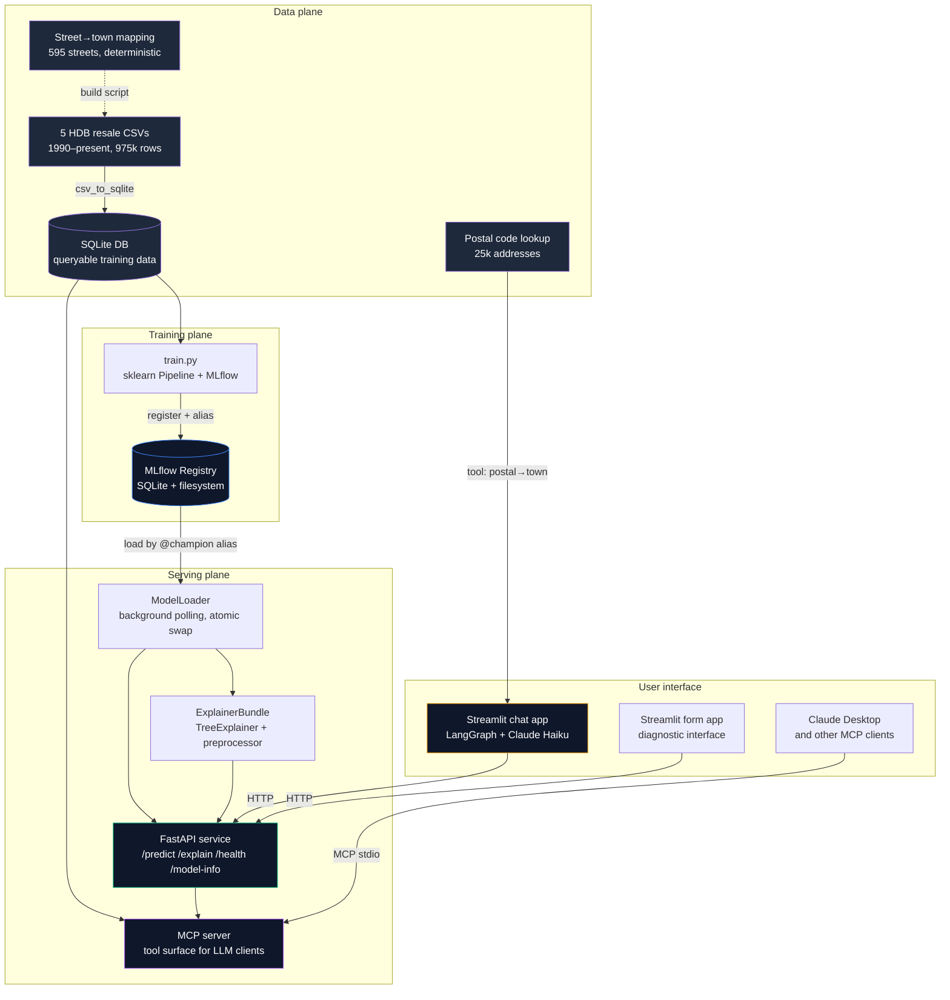

# HDB Resale Price Predictor — MLOps Platform

A production-style MLOps platform for predicting Singapore HDB resale prices, with a chat-driven user interface on top. The model trains on 30+ years of public resale transaction data, serves predictions and SHAP-based explanations through a FastAPI service, and is wrapped by a Claude Haiku agent that turns plain-English property descriptions into structured predictions with natural-language explanations of what's driving the price.

> **Status (May 2026)** — Phases 1 and 1.5 are complete. Phases 1.6a-d are in progress through May. The SQLite query layer (Phase 1.6a), MCP server (Phase 1.6b), and LangGraph orchestration (Phase 1.6c) are committed in the build plan but not yet shipped — until they land, training reads CSVs directly from `data/raw/` and the chat agent uses Claude Haiku tool use without LangGraph. See [What's next](#whats-next).

## What this demonstrates

The interesting parts of this repo, with specifics:

- **MLflow alias-based promotion** (not stages — they're deprecated). `@champion` and `@challenger` aliases drive lifecycle management. Atomic model + SHAP explainer swap under a single `threading.Lock` so the explainer can never be out of sync with the loaded model. Background thread polls the registry every 60s; reload is a pointer swap, not a service restart.
- **SHAP TreeExplainer wired into a `/explain` endpoint** with mathematical correctness asserted by test — `sum(feature_contributions) + base_value ≈ predicted_price` within 1 SGD.
- **A deliberate 5.8% RMSE trade-off** to halve the form complexity. The model predicts on 5 fields the user can actually answer (town, flat type, floor area, lease year, transaction month) instead of 7 that include `flat_model` and `storey_range` — values most users don't know off the top of their heads. RMSE went from SGD 27,690 to SGD 29,296. Documented and intentional.
- **Preprocessing baked into the sklearn `Pipeline`.** No training-serving feature pipeline duplication. The model artefact is end-to-end: raw input goes in, prediction comes out. A custom `MonthToFloatTransformer` converts `YYYY-MM` to fractional years inside the `ColumnTransformer`.
- **Postal-code first chat UX.** Users type `"3 room flat in Tampines, 95 sqm, lease started 1985, postal 528003"` in plain English. The agent calls `lookup_postal_code` to resolve postal → town, then `predict_hdb_price` for the price, then `explain_hdb_price` and narrates the top 3 SHAP contributors back to the user in English.
- **131 tests** across schemas, model loader, FastAPI endpoints, training pipeline, postal lookup, predictor, and chat agent. Pre-commit hooks enforce ruff, ruff-format, mypy, and a typed exception hierarchy in the API client.
- **Architecture Decision Records** under `docs/adr/` for choices that matter — alias-vs-stages, promotion threshold derivation, MLflow SPOF acknowledgement.

## Architecture



The training plane produces immutable, registered model versions. The serving plane serves predictions over HTTP (FastAPI) and as agent-callable tools (MCP) — same model, same explainer, two interfaces for two consumer types. The UI plane has three entry points: a chat app (LangGraph orchestrating MCP tool calls via Claude Haiku), a diagnostic form app (direct HTTP), and any external MCP client (Claude Desktop, Cursor, future agent frameworks). The data plane is read-only at runtime.

## Try it

You'll need three terminals. Prerequisites:

- Python 3.12+ with `uv` installed (`brew install uv` on macOS)
- An Anthropic API key for the chat app: `export ANTHROPIC_API_KEY="sk-ant-..."`
- HDB resale CSVs in `data/raw/` (download from data.gov.sg if you're starting fresh)

### Setup (one-time)

```bash
git clone git@github.com:LEMSingapore/hdb-mlops-platform.git
cd hdb-mlops-platform
uv venv
source .venv/bin/activate
uv pip install -e ".[dev]"
python -m training.train          # ~5 minutes, registers a model as @champion
```

Once Phase 1.6a ships, an additional `python scripts/csv_to_sqlite.py` step will populate `data/hdb.db` before training. The `python -m training.train` line stays the same — internally it'll switch from CSV reads to SQLite queries.

### Terminal 1 — FastAPI service

```bash
source .venv/bin/activate
uvicorn serving.app:app --port 8000
```

Wait for "Loaded hdb-predictor version N" and "Application startup complete".

### Terminal 2 — Chat app (primary UI)

```bash
source .venv/bin/activate
streamlit run src/ui/chat_app/streamlit_app.py
```

Browser opens at `http://localhost:8501`. Try:

> 3 room flat in Tampines, 95 sqm, lease started 1985, postal 528003

### Terminal 2 alternative — Form app (diagnostic)

```bash
streamlit run src/ui/form_app/streamlit_app.py
```

Same endpoints, simpler UI — useful for debugging when the chat misbehaves.

### Claude Desktop via MCP (Phase 1.6b — coming late May)

Once the MCP server lands, configure Claude Desktop's `claude_desktop_config.json`:

```json
{
  "mcpServers": {
    "hdb-mlops": {
      "command": "python",
      "args": ["-m", "mcp_server"],
      "cwd": "/absolute/path/to/hdb-mlops-platform"
    }
  }
}
```

Then in Claude Desktop ask:

> What's the resale price for a 4-room in Tampines, 95 sqm, lease started 1985? And show me 10 similar recent transactions.

Claude Desktop will call the MCP tools (`predict_price`, `explain_prediction`, `find_similar_transactions`) and synthesise an answer. Same model, same registry, same explainer that the Streamlit chat uses — exposed through a different protocol.

### Direct API access

```bash
curl -s -X POST http://localhost:8000/predict \
  -H "Content-Type: application/json" \
  -d '{"town": "TAMPINES", "flat_type": "4 ROOM", "floor_area_sqm": 95.0, "lease_commence_date": 1985, "month": "2024-06"}' \
  | python -m json.tool
```

## What lives where

```
src/
├── training/        Training script, sklearn pipeline, MLflow logging
├── serving/         FastAPI app, model loader, schemas, SHAP integration
├── lookup/          Postal code resolution, street→town mapping
└── ui/
    ├── chat_app/    Primary chat UI — Claude Haiku tool use over the API
    └── form_app/    Diagnostic form UI — direct API access for debugging

tests/                Mirrors src/ — comprehensive coverage, all green
docs/
├── build-plan.md    The phased delivery plan, current state, what's next
└── adr/             Architecture Decision Records (alias vs stages, etc.)
scripts/
└── build_street_town_mapping.py    Regenerates the static street→town dict
data/
├── raw/             HDB resale CSVs (DVC-tracked, not committed)
└── lookups/         Postal code reference table (committed, 700KB)
```

Coming in Phase 1.6: `src/data/` (SQLite query layer), `src/mcp_server/` (MCP tools), `scripts/csv_to_sqlite.py`, and a LangGraph state machine inside `src/ui/chat_app/`.

## Design decisions

The choices most worth defending in an interview, with PR links to the full reasoning:

- **MLflow aliases over stages** ([ADR 0001](docs/adr/0001-mlflow-aliases-not-stages.md)). Stages are deprecated in MLflow 2.9+. Aliases are more expressive — `@champion` and `@shadow` can point to different versions simultaneously, supporting champion/challenger evaluation natively.
- **5-field schema instead of 7** ([PR #20](https://github.com/LEMSingapore/hdb-mlops-platform/pull/20)). Removed `flat_model` and `storey_range` because most users can't answer them. Costs 5.8% RMSE; halves form complexity. Documented as a deliberate product trade-off.
- **Preprocessing baked into the sklearn Pipeline** ([PR #20](https://github.com/LEMSingapore/hdb-mlops-platform/pull/20), closes #9). Single artefact, no training-serving skew risk, no `_build_feature_dataframe` helper anywhere in the serving layer.
- **Background polling for model reload, not restart** ([PR #8](https://github.com/LEMSingapore/hdb-mlops-platform/pull/8)). The serving thread polls the registry every 60s and atomically swaps the in-memory model when `@champion` points to a new version. Zero downtime, no admin endpoint needed.
- **`ExplainerBundle` as an atomic swap unit** ([PR #13](https://github.com/LEMSingapore/hdb-mlops-platform/pull/13)). Bundling explainer + preprocessor + feature names rather than tracking them separately makes "model and explainer must always be consistent" a structural invariant, not a documented convention.
- **`_APIConfig` Protocol over inheritance** ([PR #21](https://github.com/LEMSingapore/hdb-mlops-platform/pull/21)). Form and chat apps both use the same `APIClient`. Rather than forcing a shared `BaseConfig`, the client accepts anything matching a `Protocol`. Structural typing, no coupling between UI subdirectories.
- **MCP separates tool surface from orchestration** ([Phase 1.6b](https://github.com/LEMSingapore/hdb-mlops-platform/issues/22)). LangGraph orchestrates *this* application's reasoning flow; MCP exposes tools that any LLM client can call. Same prediction and explanation logic serves both the bundled chat app and external clients (Claude Desktop, Cursor) without duplicate code per client.
- **Pydantic v2 strict mode caught a silent bug**. The original schemas declared `model_version: str`, MLflow returned `int`. Strict mode rejected the coercion and surfaced the mismatch immediately rather than letting it fail at runtime in production.

## Models

| Version | Features | Estimators | RMSE (SGD) | MAE (SGD) | R² | Status |
|---|---|---|---|---|---|---|
| v1 | 7 | 1000 | 27,690 | 19,125 | 0.978 | Retained |
| v4 | 5 | 1000 | 29,296 | 20,008 | 0.975 | **`@champion`** |

Both trained on 975,942 transactions with identical hyperparameters (`learning_rate=0.1`, `max_depth=6`, `min_samples_leaf=9`, `max_features=0.1`). Train-test gap on v4 is 1.9% — healthy generalisation.

## What's tested

131 tests, run with `pytest`:

| Module | Tests | What it covers |
|---|---:|---|
| `tests/serving/test_schemas.py` | 17 | Pydantic boundary conditions, validation errors, coercion rules |
| `tests/serving/test_model_loader.py` | 16 | Alias resolution, atomic swap, `ExplainerBundle` consistency on failure |
| `tests/serving/test_app.py` | 22 | All four endpoints, 503 guard, 422 validation, SHAP additivity |
| `tests/training/test_train.py` | 13 | End-to-end training in 26s with `n_estimators=20`, signature attached, alias set |
| `tests/lookup/test_postal.py` | 14 | Postal resolution, town derivation, edge cases |
| `tests/lookup/test_abbreviations.py` | 15 | Token-level expansion, idempotency, no substring collisions |
| `tests/ui/form_app/` | 9 | API client error hierarchy, config from env |
| `tests/ui/chat_app/` | 23 | Tool schemas, top-3 SHAP slice, missing-field elicitation, postal-first ordering |

A lesson from this work: **passing tests don't mean the system works.** Pydantic v2 type bugs, environment-variable plumbing in subprocess models, and explainer initialisation paths all needed live smoke testing — three terminals, real curl, real chat — to catch issues that unit tests can't see.

## What's next

The [build plan](docs/build-plan.md) tracks delivery in phases. Phases 1 and 1.5 are complete. The remainder, in order:

- **Phase 1.6a — SQLite data layer** ([#22 sibling, to be filed](https://github.com/LEMSingapore/hdb-mlops-platform/issues)). Wrap the CSV-based training pipeline with a SQLite query layer. Same data, queryable interface, foundation for `find_similar_transactions` and AIAP-aligned data loading. — Target: week of May 4
- **Phase 1.6b — MCP server** ([#22](https://github.com/LEMSingapore/hdb-mlops-platform/issues/22)). Expose `predict_price`, `explain_prediction`, `lookup_postal_code`, `get_model_info`, and `find_similar_transactions` as MCP tools so the platform is consumable from Claude Desktop and any other MCP client. — Target: late May
- **Phase 1.6c — LangGraph orchestration**. Replace the chat agent's direct tool-use loop with a LangGraph state machine that calls MCP tools. Each node handles a distinct step (parse, lookup, validate, predict, explain, narrate) with retry and error handling. — Target: late May
- **Phase 1.6d — AIAP-format README**. Restructure the project documentation to align with AIAP's 8-section submission template, dual-purposing this work for the AI Apprenticeship Programme. — Target: mid-May
- **Phase 2 — Docker + CI**. Containerise FastAPI, MCP server, and MLflow tracking. GitHub Actions for lint, type-check, test, and image build on every PR. — Target: June
- **Phase 3 — DVC + Pandera + scheduled ingestion**. Version the training data, validate it, ingest fresh data.gov.sg releases monthly via scheduled CI. — Target: July
- **Phase 4 — Prometheus + Grafana monitoring**. HTTP metrics, prediction distribution histograms, model version gauge, alert rules. — Target: July
- **Phase 5 — Evidently + retrain/promotion gate**. Drift detection writes back to Prometheus. Retraining triggers gated by a CV-noise-floor promotion check, replacing the current auto-promote behaviour. — Target: August
- **Phase 6 — Deployment**. Always-on URL via k3s on a small VPS. Recorded AKS demo for the Kubernetes story without permanent cloud cost. — Target: August

Open issues:

- [#10](https://github.com/LEMSingapore/hdb-mlops-platform/issues/10) — Pin model serving environment to match training environment. Phase 2 work.
- [#22](https://github.com/LEMSingapore/hdb-mlops-platform/issues/22) — MCP server (Phase 1.6b).

## Out of scope (deliberately)

A few things this project does not include, and why:

- **Feature store** (Feast, Tecton, etc.). Overkill for a single-team, single-model project. The training-serving skew risk that feature stores solve is already addressed by baking preprocessing into the sklearn `Pipeline`.
- **A/B testing infrastructure beyond `@shadow` aliases**. MLflow aliases support shadow-mode evaluation; building proper traffic splitting would belong in a multi-service deployment.
- **Model cards.** The README and ADRs cover the same ground informally. Building structured model cards adds process overhead without changing what an interviewer learns about the work.
- **External data integration in the MCP server** (PropertyGuru listings, news APIs, neighbourhood data). The MCP layer exposes the platform's own capabilities. Combining with external data sources is a separate product.
- **Multi-cloud deployment.** Phase 6 picks one cloud (AKS for the K8s narrative) plus a self-hosted VPS for the live URL. Cross-cloud abstraction is yak-shaving until it isn't.
- **Authentication on the API.** The platform is a portfolio piece, not a multi-tenant service. Auth is a Phase 2+ concern when CI starts deploying it somewhere reachable.

---

Built by [Mikey (Chang Chee Young)](https://github.com/lemsingapore) — AI solutions developer based in Singapore. Reach me on [LinkedIn](https://www.linkedin.com/in/changcheeyoung/).
